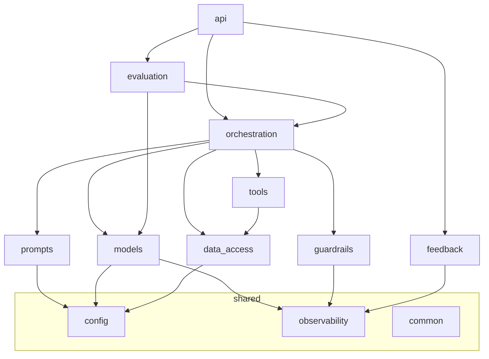
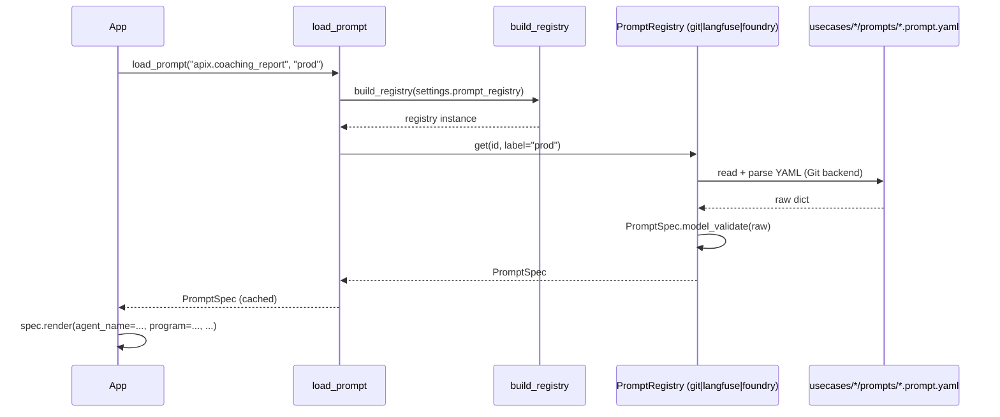
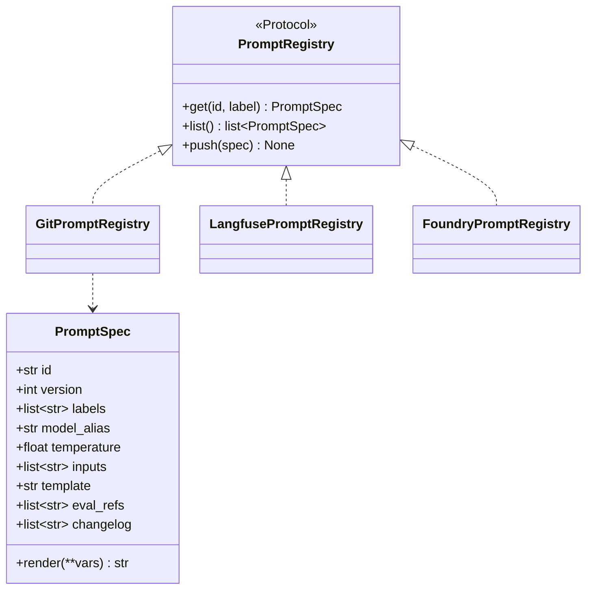
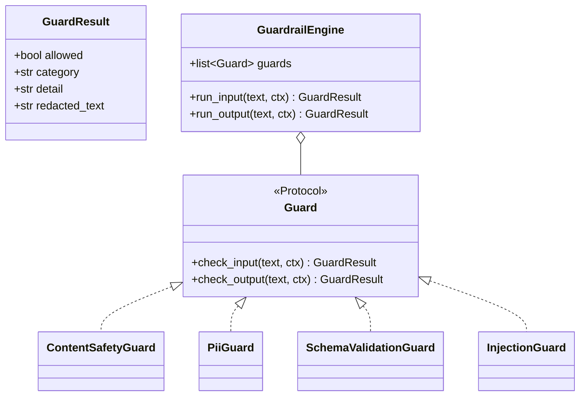
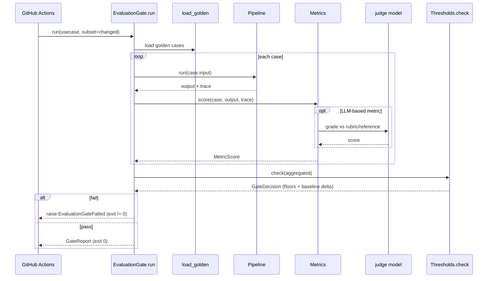

# Low-Level Design (LLD) — LLMOps Platform backend

Per-package reference for the `llmops` backend package. Signatures below are the contract
from `../ARCHITECTURE_SPEC.md`; some packages are scaffolded (`config`, `common`) and the
rest are implemented to these interfaces. Every adapter that needs a live Azure/Langfuse
client marks the construction line with `# TODO(wiring): ...` and degrades to a mock in
dev — those TODOs are indexed in `todo.html`.

Import root is `llmops` (e.g. `from llmops.models.router import ModelRouter`). All I/O is
async; sync wrappers exist only in the CLIs. Errors subclass
`llmops.common.errors.LLMOpsError`. IDs come from `llmops.common.ids`. Nothing prints; use
`llmops.common.logging.get_logger(__name__)`.

Package dependency direction (higher depends on lower; none reach back up):



---

## config

Files: `settings.py`, `models_config.py`.

- `Settings(BaseSettings)` — pydantic-settings, `env_prefix="LLMOPS_"`, reads `.env`.
  Fields: `environment` (dev|test|prod), Azure OpenAI endpoint/version/key, Azure Search
  endpoint/key, Document Intelligence endpoint, Content Safety endpoint, Cosmos
  endpoint/database, App Insights connection string, Langfuse host/keys, `otel_enabled`,
  `prompt_registry` (git|langfuse|foundry), `models_config_path`, `usecases_dir`,
  `api_cors_origins`. Secret fields use `repr=False`. Helper `is_prod()`.
- `get_settings() -> Settings` — `lru_cache` singleton (twelve-factor: config from env).
- `ModelsConfig(BaseModel)` with `environments: dict[str, EnvAliases]` and
  `resolve(alias, env) -> str` (raises `UnknownAliasError`). `load_models_config(path)`
  parses/validates `platform/models.yaml`, wrapping failures in `ConfigError`.

**Data models**: `Settings`, `ModelsConfig`, `EnvAliases`.
**Extension points**: add a field to `Settings` (and `.env.example`) for a new service;
add an environment/alias to `models.yaml`. In Azure, secret values are Key Vault
references injected via Managed Identity — the endpoints here are non-secret.

---

## common

Files: `logging.py`, `errors.py`, `types.py`, `ids.py`.

- `logging.get_logger(name) -> _ContextLogger` — structured key=value logging; accepts
  loose kwargs as context (`log.info("msg", trace_id=..., cost=...)`). `configure_logging`
  is idempotent. In prod the OTel logging exporter ships these to App Insights, correlated
  with the active span.
- `errors.LLMOpsError(message, *, detail)` base with `code`, `http_status`, `to_dict()`.
  Subclasses: `ConfigError` (500), `UnknownAliasError` (400), `PromptNotFoundError` (404),
  `PromptRenderError` (400), `GuardrailBlocked` (422, expected control-flow),
  `ToolError` (502), `EvaluationGateFailed` (422), `UpstreamError` (502). FastAPI exception
  handlers map any `LLMOpsError` to a stable JSON body via `to_dict()`.
- `types.py` value objects: `Usage(input_tokens, output_tokens, total_tokens)`,
  `ChatResult(text, model, usage, cost_usd, latency_ms, finish_reason, cache_hit)`,
  `ToolResult(name, ok, output, error, latency_ms)`, `Chunk(id, text, score, source,
  metadata)`, `Environment` enum.
- `ids.py`: `new_trace_id()` (32-hex, one per request), `new_span_id()` (16-hex),
  `new_id(prefix)` (short prefixed id, e.g. `fb_...`).

**Extension points**: add an exception subclass with a `code`/`http_status`; add a shared
value object here to avoid cross-package circular imports.

---

## prompts

Files: `schema.py`, `loader.py`, `base.py`, `git.py`, `langfuse.py`, `foundry.py`,
`factory.py`.

- `schema.PromptSpec(BaseModel)` mirrors the `.prompt.yaml`: `id, version, labels,
  model_alias, temperature=0.2, inputs, template, eval_refs=[], changelog=[]`.
  `render(**vars) -> str` fills `{{var}}` placeholders and validates all `inputs` are
  present (raises `PromptRenderError` otherwise).
- `base.PromptRegistry(Protocol)`: `get(prompt_id, label="prod") -> PromptSpec`,
  `list() -> list[PromptSpec]`, `push(spec) -> None` (Git -> registry sync).
- `git.GitPromptRegistry` (default) reads `usecases/*/prompts/*.prompt.yaml`.
  `langfuse.LangfusePromptRegistry` and `foundry.FoundryPromptRegistry` are adapters with
  `# TODO(wiring)` client construction; they degrade to the Git backend or a mock in dev.
- `factory.build_registry(kind, settings)` returns the backend named by
  `settings.prompt_registry`.
- `loader.load_prompt(prompt_id, label="prod") -> PromptSpec` — the only call site app
  code uses; selects the backend via the factory; caches (`lru_cache`) per id+label.

**Data models**: `PromptSpec`.
**Sequence — prompt load (`load_prompt`)**:



**Class view**:



**Extension points**: add a registry backend by implementing `PromptRegistry` and
registering it in `factory.build_registry`. No call-site change needed.

---

## models

Files: `router.py`, `client.py`, `pricing.py`.

- `router.ModelRouter(config: ModelsConfig, env: str)` with `resolve(alias) -> str`
  (alias -> Azure deployment name; raises `UnknownAliasError`).
- `client.ModelClient` — async wrapper over Azure OpenAI. `chat(*, alias, messages,
  prompt_id=None, temperature=0.2) -> ChatResult`. It opens a `model_call_span`, resolves
  the alias, calls Azure OpenAI, and attaches `usage`, `cost_usd`, `model`, `latency_ms`.
- `pricing.py`: `PRICES: dict[str, ModelPrice]`; `cost_usd(deployment, usage) -> float`
  (= input_tokens x in_price + output_tokens x out_price, per the price table).

**Data models**: `ChatResult`, `Usage` (from `common.types`), `ModelPrice`.
**Sequence — a chat call** is embedded in the pipeline-run sequence below.
**Extension points**: add an alias in `models.yaml`; add a `ModelPrice` row in `pricing.py`
for a new deployment; wrap a non-Azure provider by implementing the same `chat` signature.

---

## observability

Files: `tracing.py`, `cost.py`, `exporters.py`.

- `init_tracing(settings)` sets up OpenTelemetry with GenAI semantic conventions.
  `get_tracer()`, `span(name, **attrs)` (context manager; sets attributes, records
  exceptions). `model_call_span(alias, deployment, prompt_id, prompt_version)` yields a
  span the caller fills with usage + cost. `tool_call_span(name, mcp_server, args,
  expected_tool=None)` sets `eval.was_correct_tool` when `expected_tool` is given.
- `cost.py` attaches `app.cost_usd` to spans and provides aggregation helpers.
- `exporters.py` exports the same spans to Application Insights
  (`azure-monitor-opentelemetry`) and Langfuse. Cost is computed once at emit; both sinks
  see the same attribute (no double counting). See ADR 0005.

Spans nest `request > agent > model/tool`; one trace id per request. Attributes captured
per level answer the client's three questions (every request, model calls, tool calls,
agent sessions).

**Extension points**: add an exporter in `exporters.py`; add a new span helper for a new
call type; extend the attribute set (keep GenAI semantic-convention names).

---

## guardrails

Files: `base.py`, `engine.py`, `content_safety.py`, `pii.py`, `schema_validation.py`,
`injection.py`.

- `base.GuardResult(BaseModel)`: `allowed, category, detail, redacted_text=None`.
  `base.Guard(Protocol)`: `check_input(text, ctx) -> GuardResult`,
  `check_output(text, ctx) -> GuardResult`.
- `engine.GuardrailEngine` runs an ordered list of `Guard`s; on a block it raises
  `GuardrailBlocked` (an expected 422, not a 500).
- Adapters: `content_safety.py` (Azure AI Content Safety categories + Prompt Shields +
  groundedness/protected-material), `pii.py` (Presidio or Azure AI Language PII, returns
  `redacted_text`), `schema_validation.py` (pydantic/JSON-schema on model output),
  `injection.py` (Prompt Shields). All carry `# TODO(wiring)`.

Placement: input checks run before the model, output checks before returning/storing.

**Class view**:



**Extension points**: implement `Guard` and add it to the engine's ordered list (order
matters: PII redaction before content classification, etc.); tune per-use-case policy in
`usecases/<uc>` config.

---

## data_access

Files: `base.py`, `rag.py`, `sql.py`, `documents.py`, `records.py`.

- `base.DataSource(Protocol)`: `async query(q, **kw) -> Any`.
- `rag.RagRetriever(search_endpoint, index)`: `retrieve(query, k) -> list[Chunk]` over
  Azure AI Search.
- `sql.SqlDataSource`: NL2SQL + safe **read-only**, parameterised execution over
  **allow-listed** tables (structured data does NOT go through RAG).
- `documents.DocumentExtractor`: Azure AI Document Intelligence `extract(file) ->
  ExtractedDoc`.
- `records.RecordClient`: `get_record(system, id)` for systems of record.

**Data models**: `Chunk` (common.types), `ExtractedDoc`.
**Extension points**: add a `DataSource` implementation; add a table to the SQL allow-list;
add a new index/alias for RAG. Keep SQL read-only and parameterised.

---

## tools

Files: `base.py`, `registry.py`, `search_knowledge.py`, `query_sql.py`,
`extract_document.py`, `get_record.py`.

- `base.Tool(BaseModel)`: `name`, `description`, `input_schema` (pydantic), `async run(**
  kwargs) -> ToolResult`. MCP-compatible descriptions (MCP = Model Context Protocol).
- `registry.ToolRegistry` loads `platform/tools/registry.yaml`; `get(name) -> Tool`.
- The four reusable tools wrap the data-access layer: `search_knowledge` (RAG),
  `query_sql` (structured), `extract_document` (Document Intelligence), `get_record`
  (systems of record). Each emits a `tool_call_span`.

**Extension points**: add a `Tool` subclass, register it in `platform/tools/registry.yaml`,
and reference it from an agent's `tools` list. Use-case-specific tools live under
`usecases/<uc>/tools/`.

---

## orchestration

Files: `pipeline.py`, `agent.py`, `step.py`, `state.py`, `context.py`.

- `agent.Agent`: `name`, `role`, `prompt_id`, `tools: list[str]`, `model_alias`;
  `async run(ctx: PipelineContext) -> AgentResult`. Loads its prompt via `load_prompt`,
  renders, optionally calls tools, then the model.
- `step.Step`: wraps an `Agent` or a plain function; records an agent span.
- `pipeline.Pipeline`: `name`, `steps: list[Step]`; `async run(input: dict) ->
  PipelineResult`. **Sequential**, not agent-to-agent (ADR 0004). Loads from
  `usecases/<uc>/agents/pipeline.agent.yaml`.
- `state.PipelineState`: persisted to Cosmos for checkpoint/resume (adapter with TODO
  wiring; in-memory default in dev).
- `context.PipelineContext`: carries `trace_id`, inputs, shared memory, settings.

**Sequence — a pipeline run** (see also `diagrams/sequence-pipeline-run.mmd`):

```mermaid
sequenceDiagram
    participant API
    participant Pipe as Pipeline
    participant Guard as GuardrailEngine
    participant Agent
    participant PR as load_prompt
    participant MC as ModelClient
    participant Tool
    participant Obs as tracing
    API->>Pipe: run(input)
    Pipe->>Obs: start request span (trace_id)
    Pipe->>Guard: run_input(text)
    loop each Step
        Pipe->>Obs: start agent span
        Pipe->>Agent: run(ctx)
        Agent->>PR: load_prompt(prompt_id, "prod")
        PR-->>Agent: PromptSpec
        opt tool step
            Agent->>Tool: run(args)  (tool span; was_correct_tool)
            Tool-->>Agent: ToolResult
        end
        Agent->>MC: chat(alias, messages, prompt_id)
        MC->>Obs: model_call_span (tokens, cost)
        MC-->>Agent: ChatResult
        Agent-->>Pipe: AgentResult (-> shared context)
    end
    Pipe->>Guard: run_output(final_text)
    Pipe-->>API: PipelineResult
```

**Extension points**: define a new pipeline in `usecases/<uc>/agents/pipeline.agent.yaml`
(ordered steps, each -> a prompt + tools + model alias); add a step type; swap the state
backend by implementing the state adapter.

---

## evaluation

Files: `golden.py`, `thresholds.py`, `gate.py`, `runner.py`,
`metrics/{base,ragas,deepeval,tool_selection,judge}.py`.

- `golden.load_golden(path) -> list[GoldenCase]`; `GoldenCase(id, input, grading, meta)`.
- `metrics/base.Metric(Protocol)`: `name`; `async score(case, output, trace) ->
  MetricScore`.
- Metrics: `ragas.py` (groundedness, context/answer relevance via Ragas), `deepeval.py`
  (writing quality / G-Eval), `tool_selection.py` (custom, reads the trace: accuracy,
  wrong-tool rate, missing-tool rate, arg-correctness, per-tool precision/recall),
  `judge.py` (LLM-as-judge using the small `judge` alias against a rubric).
- `thresholds.load(evaluators.yaml) -> Thresholds`; `check(scores) -> GateDecision`
  (baseline-relative delta + absolute floors).
- `gate.EvaluationGate.run(usecase, subset|full) -> GateReport` (pass/fail per metric,
  blocks CI).
- `runner.py` orchestrates: for each golden case run the pipeline, collect the trace,
  score with metrics, apply thresholds.

**Data models**: `GoldenCase`, `MetricScore`, `Thresholds`, `GateDecision`, `GateReport`.
**Sequence — the evaluation gate** (see also `diagrams/sequence-eval-gate.mmd`):



**Extension points**: add a metric by implementing `Metric` and listing it in
`evaluators.yaml`; add absolute floors / baseline deltas per use case in that file; extend
`GoldenCase.grading` for new grading rules.

---

## feedback

Files: `models.py`, `store.py`, `service.py`.

- `models.FeedbackEvent(trace_id, kind, value, reason, user_hash, ts)` where `kind` is
  `thumbs|edit|override`. `user_hash` is a hashed identifier (no raw user id).
- `store.FeedbackStore` writes App Insights custom events + Cosmos.
- `service.FeedbackService.capture(...)` records an event; `to_golden_candidate(...)`
  turns a confirmed bad case into a golden-dataset candidate.

**Extension points**: add a feedback `kind`; add an analytics rollup; wire triage export to
the golden-dataset workflow.

---

## api (FastAPI control plane)

Files: `main.py`, `deps.py`, `routers/{health,prompts,models,evaluations,traces,costs,
feedback,agents,guardrails,usecases}.py`. All routes under `/api/v1`.

| Method + path | Purpose |
|---|---|
| `GET /health` | liveness/readiness |
| `GET /prompts` | list prompts (id, version, labels) |
| `GET /prompts/{id}` | one `PromptSpec` |
| `POST /prompts/{id}/render` | render with vars (dev helper) |
| `GET /models` | aliases + resolved deployments (per env) |
| `GET /evaluations` | recent gate reports |
| `POST /evaluations/run` | run gate for a use case (subset|full), async task |
| `GET /traces` | recent traces (App Insights/Langfuse read-through, TODO wiring) |
| `GET /costs` | cost aggregates by use case/day/model |
| `POST /feedback` | capture a `FeedbackEvent` |
| `GET /agents` | list pipelines/agents from `usecases/*/agents` |
| `GET /guardrails` | configured guardrails + last events |
| `GET /usecases` | onboarded use cases + status |

- `main.py` wires routers, CORS, exception handlers (map `LLMOpsError` -> stable JSON),
  the OpenTelemetry middleware, and a lifespan hook that initialises tracing + settings.
- `deps.py` provides `get_settings`, the prompt registry, model router, and guardrail
  engine via FastAPI `Depends` (dependency injection, easy to mock in tests).

**Extension points**: add a router module + include it in `main.py`; add a `Depends`
provider in `deps.py`. Keep endpoints thin — logic lives in the feature packages.

---

## Testing

`pytest`. Unit tests cover pure logic (router resolution, thresholds, pricing, prompt
render/schema). Integration tests are marked `@pytest.mark.integration` and are skipped
without live Azure. `conftest.py` provides settings and registry fixtures wired to mocks.
