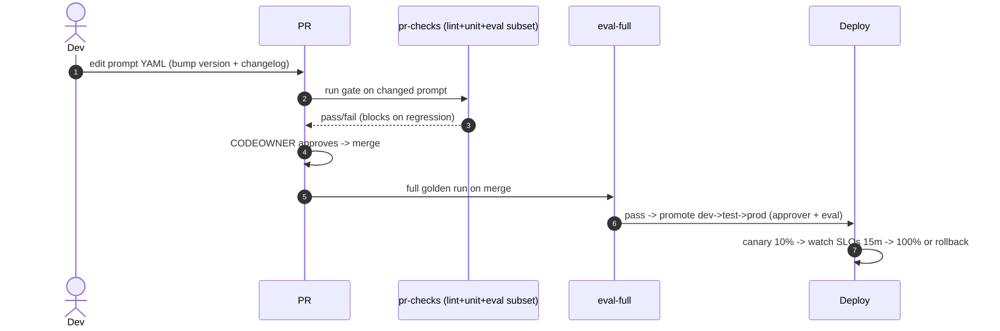
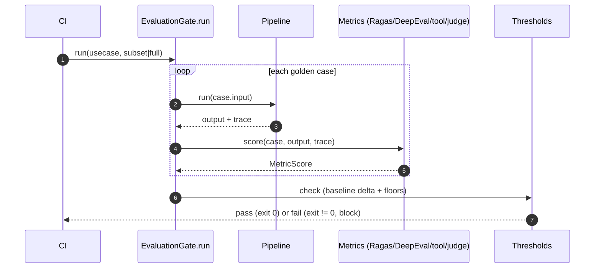
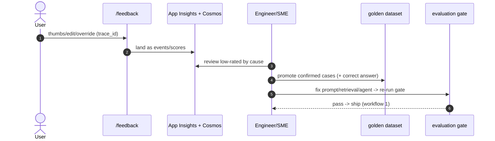
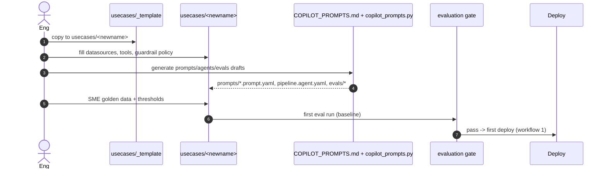

# Operational Workflows — LLMOps Platform

Working notes for the day-to-day operations of the platform. Each workflow lists the steps
and a Mermaid sequence diagram. These stay in sync with the v2 deck's CI/CD framing
(author -> pull request -> automated checks -> evaluation gate -> merge -> promotion gates
-> canary -> full rollout / auto-rollback).

Terms: PR = pull request; CI/CD = continuous integration / continuous delivery; SLO =
service-level objective; OIDC = OpenID Connect (used for keyless federated login from
GitHub to Azure); SME = subject-matter expert.

---

## 1. Prompt change -> production (with the evaluation gate)

This is the flagship flow — the concrete difference from "prompts are already in Git." The
delta is the versioned YAML artifact **plus** an evaluation gate on every change.

Steps:
1. **Author** edits `usecases/<uc>/prompts/<name>.prompt.yaml`: change the `template`,
   bump `version`, add a `changelog` line. Keep `inputs`, `model_alias`, `eval_refs`.
2. **Open a PR**. `CODEOWNERS` requires review because the path is prompt-owned.
3. **Automated checks** run (`pr-checks.yml`): lint, unit, contract tests.
4. **Evaluation gate** (subset): `python evals/run.py --subset changed --fail-under
   baseline` runs Ragas + DeepEval + tool-selection on the changed prompt against the
   golden dataset in `eval_refs`. If any metric drops past its baseline or breaks an
   absolute floor, the job exits non-zero and the PR is blocked.
5. **Reviewer approves**; merge to `main`.
6. **eval-full** runs the full golden set on merge; on merge, CI also pushes the YAML to
   the runtime registry if Langfuse/Foundry is enabled (Git backend needs no push).
7. **Promotion gates**: `deploy.yml` promotes dev (auto) -> test (approver + eval-full) ->
   prod (approver + eval-full).
8. **Canary**: new revision at ~10% traffic; watch SLOs (latency, errors, groundedness)
   ~15 min; ramp to 100% if healthy, else auto-rollback. The `prod` label still points at
   the previous prompt version until the new revision is fully promoted, so rollback is
   instant.

Diagram: `diagrams/sequence-prompt-change.mmd` (also inlined in HLD 4.1).



---

## 2. Adopting a new model

A model swap is a **config change that must pass the evaluation gate** — not a code edit,
not a portal click.

Steps:
1. **Create the deployment** in Azure OpenAI (a deployment *name*).
2. **Add a price row** in `backend/src/llmops/models/pricing.py` so `app.cost_usd` stays
   accurate for the new deployment.
3. **Edit `platform/models.yaml`**: point an alias (e.g. `reason`) at the new deployment
   for the target environment. Application code is untouched (it asks for `reason`).
4. **Open a PR**. The evaluation gate re-runs the golden set with the new model behind the
   alias; a regression blocks the change.
5. **Promote** dev -> test -> prod as in workflow 1; canary watches SLOs; rollback = revert
   the one-line YAML change.

```mermaid
sequenceDiagram
    autonumber
    actor Eng
    participant Azure as Azure OpenAI
    participant Repo as models.yaml + pricing.py
    participant Gate as evaluation gate
    participant Deploy
    Eng->>Azure: create new deployment
    Eng->>Repo: point alias -> new deployment (+ price row)
    Repo->>Gate: PR re-runs golden set behind the alias
    Gate-->>Repo: pass/fail
    Repo->>Deploy: promote per env; canary; rollback = revert YAML
```

---

## 3. The evaluation gate (offline + online)

**Offline** (in CI, blocking): for each golden case, run the pipeline, collect the trace,
score with the metric groups, apply thresholds.

Metric groups -> mechanism:
- RAG (groundedness, context/answer relevance) -> **Ragas**.
- Writing quality (coherence, fluency, correctness/similarity) -> **DeepEval / G-Eval**.
- Agent behaviour (correct tool usage, arg correctness) -> **custom Python**
  (`tool_selection`), read from the trace — Ragas/DeepEval do not cover this.
- Task success / rubric grading -> **LLM-as-judge** using the small `judge` alias.

Thresholds (`evaluators.yaml`): from a **baseline run** (current prod), gate rule = "no
metric drops more than X% below baseline" plus **absolute floors** (PII leak rate = 0,
unsafe = 0) and **minimums** for critical metrics (e.g. groundedness >= 0.9). Cost driver
= judge tokens x dataset size x runs; mitigate with a small judge, subset on PR, full
nightly.

**Online** (in production, non-blocking): a sample of live traffic is scored with the same
metrics (e.g. groundedness on real answers) to catch drift the golden set misses; results
feed dashboards and alerts. Confirmed failures become feedback (workflow 4).

Diagram: `diagrams/sequence-eval-gate.mmd` (also inlined in LLD `evaluation`).



---

## 4. The feedback loop

Turn bad answers into tests, then fix and re-evaluate.

Steps:
1. **Capture** feedback tied to a trace id: thumbs + reason, coach edits, overrides
   (`POST /feedback` -> `FeedbackService.capture`).
2. **Land** it as scores/events in Application Insights + Cosmos (and Langfuse).
3. **Triage negatives**: review low-rated/failed responses and sort by cause — bad
   retrieval? wrong tool? weak prompt? missing data? — and prioritise.
4. **Add to golden dataset**: turn a confirmed bad case into a new golden case with the
   correct expected answer (`to_golden_candidate`).
5. **Fix & re-evaluate**: change the prompt/retrieval/agent and run the gate (workflow 3).
6. **Ship** via workflow 1.



---

## 5. Onboarding a new use case

A use case **inherits** the shared platform (CI/CD, gate, tracing, tool catalog, gateway,
guardrail engine) but must **define its own** content. It is genuinely more than "add four
files."

Steps:
1. **Copy the template**: `usecases/_template/ -> usecases/<newname>/`.
2. **Data sources**: fill `config/datasources.yaml` (RAG index, SQL tables, document
   sources, systems of record) and wire connectors.
3. **Retrieval/index**: create the Azure AI Search index/alias; ingest -> clean/PII ->
   chunk -> embed (see `index-refresh` workflow).
4. **Tools**: reuse from `platform/tools/` or add use-case-specific tools under
   `usecases/<newname>/tools/`.
5. **Prompts**: author `prompts/*.prompt.yaml` (use `COPILOT_PROMPTS.md` +
   `copilot_prompts.py` to generate first drafts in the client environment).
6. **Pipeline**: define `agents/pipeline.agent.yaml` (ordered steps -> prompt + tools +
   model alias).
7. **Golden data + thresholds**: SME-authored golden cases in `evals/*.jsonl`; set
   `evals/evaluators.yaml` thresholds from a baseline run.
8. **Guardrail policy**: tune the guardrail list/policy for the use case.
9. **Dashboards**: add cost/quality dashboards.
10. **Register**: it now appears under `GET /usecases` and the Console onboarding page;
    run the first eval and first deploy.



---

## 6. Index refresh (supporting workflow)

`index-refresh.yml` (scheduled) keeps RAG data current: ingest new source data -> clean +
PII scrub -> chunk -> embed (via the `embed` alias) -> upsert into the Azure AI Search
index behind an **alias** so the switch to the new index is atomic and reversible. For
APIX this is transcripts + metadata; for Hiring it is job descriptions + rubrics.
